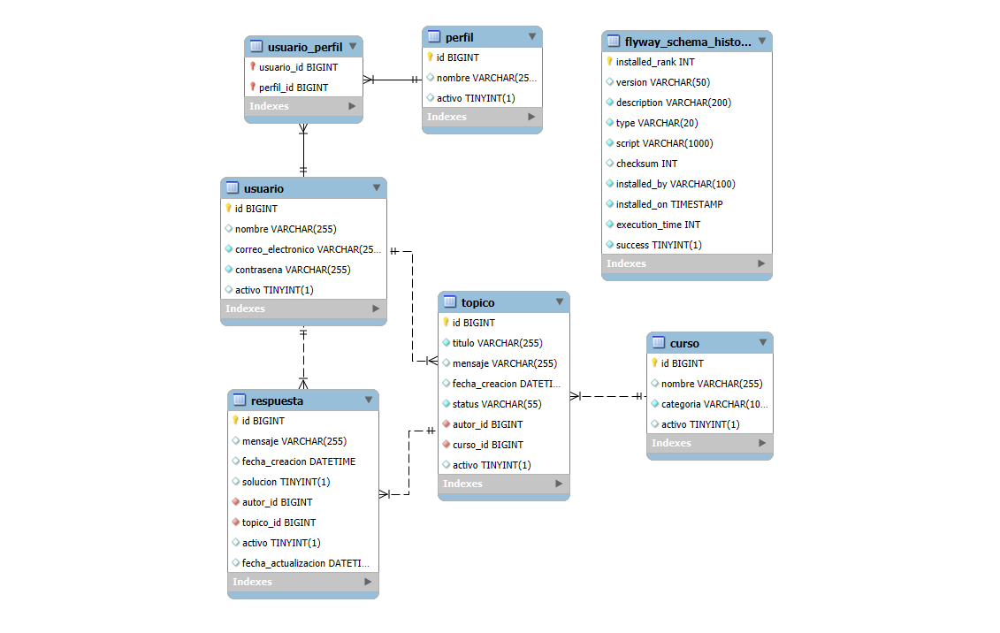
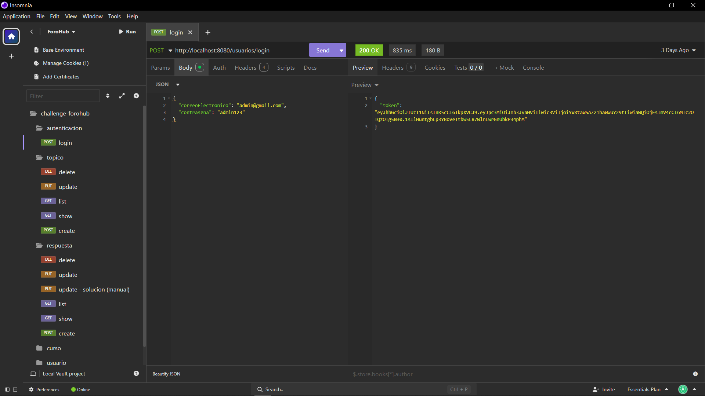
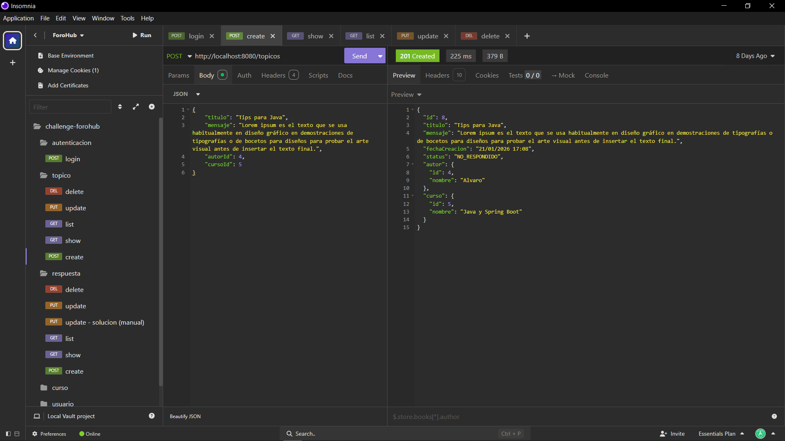
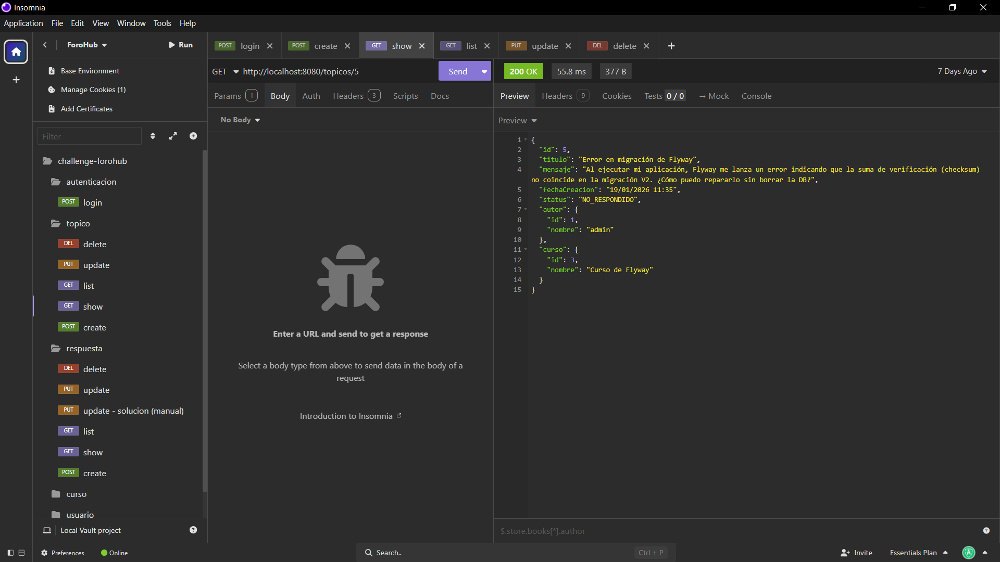
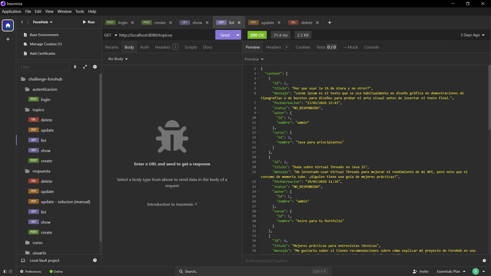
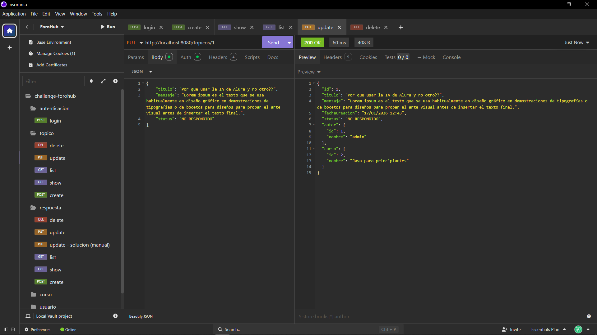
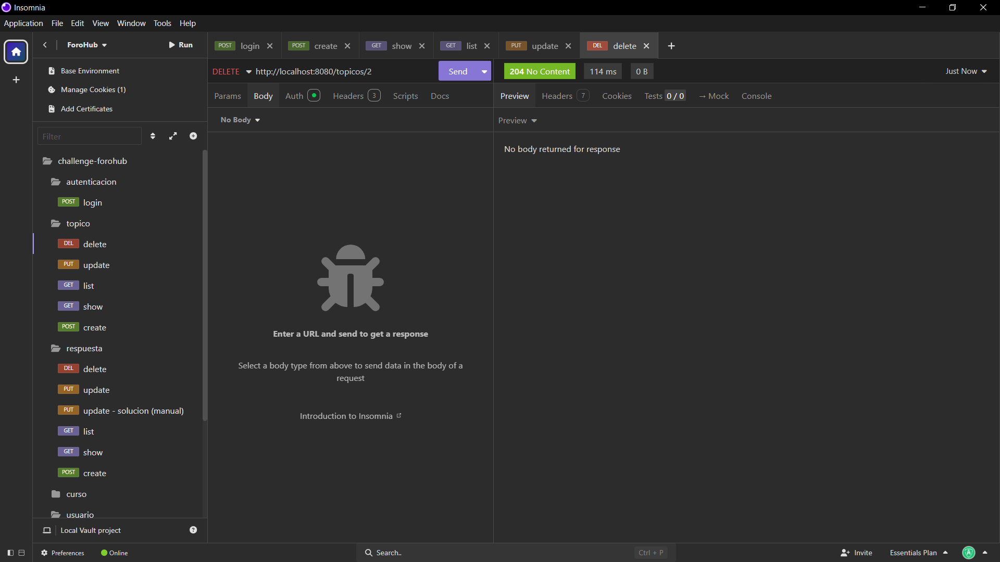

# 💬 Challenge ForoHub - API REST

Este proyecto es una solución al desafío **ForoHub**, que consiste en replicar el funcionamiento a nivel de backend de un foro de discusión. La aplicación se centra en la gestión de tópicos (preguntas o temas de discusión), permitiendo a los usuarios crear, consultar, actualizar y eliminar hilos, todo bajo un entorno seguro con autenticación basada en tokens.

## ✨ Funcionalidades del Sistema

### 📋 Gestión de Tópicos (CRUD)
- **Registro de Tópicos:** Permite crear nuevos temas validando que no existan duplicados (mismo título y mensaje).
- **Listado Completo:** Recupera todos los tópicos almacenados.
- **Paginación y Ordenado:** Consulta optimizada con `Pageable` para mostrar resultados ordenados por fecha de creación.
- **Detalle de Tópico:** Consulta específica por ID para obtener toda la información de un tema.
- **Actualización:** Modificación de datos de tópicos existentes con validación de ID.
- **Eliminación:** Borrado lógico o físico de registros de la base de datos.

### 🔐 Seguridad y Autenticación
- **Sistema de Login:** Endpoint `/login` para autenticación de usuarios.
- **Tokens JWT:** Generación y validación de JSON Web Tokens para proteger las rutas privadas.
- **Control de Acceso:** Uso de Spring Security para asegurar que solo usuarios autenticados puedan interactuar con la API.

### 🌟 Funcionalidades Extra (Implementadas)
- **Módulo de Perfiles:** Gestión de perfiles de usuario.
- **Módulo de Usuarios:** Gestión de usuarios.
- **Módulo de Cursos:** Gestión de cursos.
- **Módulo de Respuestas:** Capacidad de responder a tópicos existentes.
- **Documentación Interactiva:** Implementación de **Swagger (SpringDoc)** para probar los endpoints desde el navegador.

## 🛠️ Tecnologías y Entorno de Desarrollo

Este proyecto utiliza las versiones más recientes del ecosistema Java:

* **Lenguaje:** Java 25 (LTS).
* **Framework:** Spring Boot 4.0.1 (o superior).
* **Gestor de Dependencias:** Maven.
* **Base de Datos:** MySQL.
* **Migraciones:** Flyway Migration.
* **Seguridad:** Spring Security & Auth0 JWT.
* **Documentación:** SpringDoc OpenAPI (Swagger).

### **Dependencias Principales**
- `Spring Data JPA`: Persistencia de datos y consultas.
- `Validation`: Validación de datos mediante anotaciones (`@NotNull`, `@NotBlank`, etc.).
- `Lombok`: Reducción de código repetitivo (Boilerplate).
- `MySQL Driver`: Conector para la base de datos.
 
**Dependencias para agregar al crear el proyecto con [Spring Initializr](https://start.spring.io/):** 
- Lombok
- Spring Web
- Spring Boot DevTools
- Spring Data JPA
- Flyway Migration
- MySQL Driver
- Validation
- Spring Security

## 🗄️ Estructura de la Base de Datos

La base de datos se gestiona mediante Flyway. Los campos principales de la tabla `topicos` son:
- `id` (BigInt - PK)
- `titulo` (Varchar)
- `mensaje` (Text)
- `fecha_creacion` (Timestamp)
- `status` (Varchar)
- `autor` (Varchar)
- `curso` (Varchar)



## 📸 Documentación de la API (Swagger)

Una vez ejecutada la aplicación, puedes acceder a la interfaz de Swagger para probar todos los endpoints:
`http://localhost:8080/swagger-ui.html`

## 🖼️ Capturas de Pantalla (Pruebas en Postman/Insomnia)

#### 1. Autenticación (Login)
Obtención del token Bearer para acceder a las rutas protegidas.


#### 2. Registro de un nuevo Tópico
Validación de campos obligatorios y prevención de duplicados.


#### 3. Mostrar detalle del Tópico
Visualización la información del tópico.


#### 4. Listado con Paginación
Visualización de tópicos ordenados por fecha.


#### 5. Actualizar información del Tópico
Actualizar información del tópico con validación de campos obligatorios y prevención de duplicados.


#### 6. Eliminar Tópico (Lógico)
Eliminación lógica de un Tópico, no es una eliminación fisica de la BD.


## 🎬 Video Demostración Completa
Funcionamiento: 
- *Registro de Tópicos*
- *Listado Completo*
- *Paginación y Ordenado*
- *Detalle de Tópico*
- *Actualización*
- *Eliminación*


- *Documentación Interactiva - Swagger (SpringDoc)*


[📥 Descargar Demostración en Video](assets/video/Forohub_min.mp4)

## 🚀 Configuración y Ejecución

1. **Clonar el repositorio:**
   ```bash
   git clone https://github.com/tu-usuario/challenge-forohub.git
   cd challenge-forohub